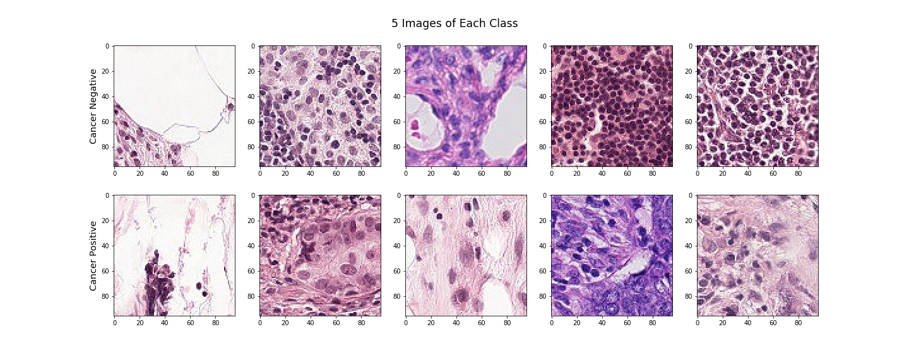
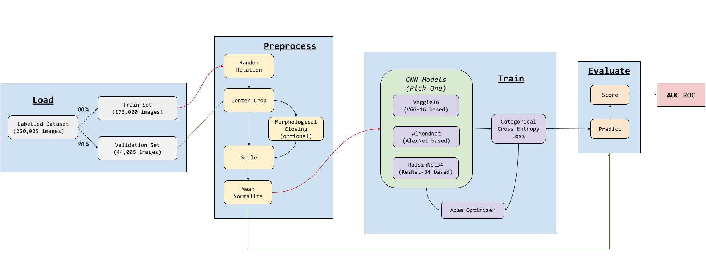
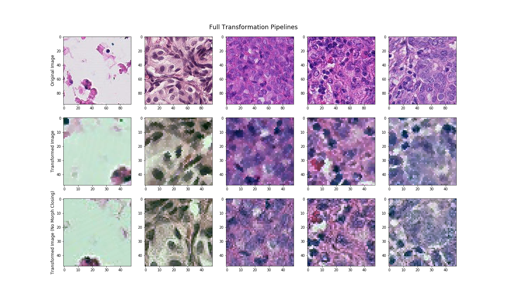

# Histopathology

CNNs to Detect Metastatic Cancer in Pathology Slides. 

--- 
## About

### Repository Structure

* `notebooks/`: An assortment of experiments on data loading, visualization, model structure, and more.
* `noteboks/lib/`: Finalized implementations of models, datasets, transforms, and more.
* `figures/`: Graphics generated during exploration, experimentation, and evaluation.
* `predictions/`: Predictions on the test set for each iteraction of the model.
* `kaggle/`: The `lib` functions combined into one file because the Kaggle kernel is a pain with helper scripts.

### Dataset

It is recommended to download the PatchCamelyon dataset [1] (~7.4GB) from [Kaggle](https://www.kaggle.com/c/histopathologic-cancer-detection/) and store it in the root of this repository as `data/`.

Alternatively, data can be downloaded onto Google Drive, and accessed by running the
notebooks on Google Colab. See `notebooks/download_data.ipynb` for details.

The dataset consists of a train and test set. The train set has 220,025 labelled 96x96 RGB .tif images. The test set has 57458 unlabelled images of the same size and format. The distribution of classes in the set is 40.5031% positive (89,117 examples) and 59.4969% negative (130,908 examples). 

### Stack

The experiments in this repository are built using `PyTorch` and `Torchvision`.

---

## Experiments

The overall pipeline diagram for the experiments in this project is described below.

### Preprocessing

The following transforms were considered:

- Random rotations
- Center cropping
- Morphological closing
- Channel-wise mean normalization

### Models

1. Veggie16 (Adapted from VGG-16)
2. AlmondNet (Adapted from AlexNet)
3. RaisinNet34 (Adapted from RaisinNet-34)

---

## References

1. B. S. Veeling, J. Linmans, J. Winkens, T. Cohen, M. Welling. "Rotation Equivariant CNNs for Digital Pathology". arXiv:1806.03962